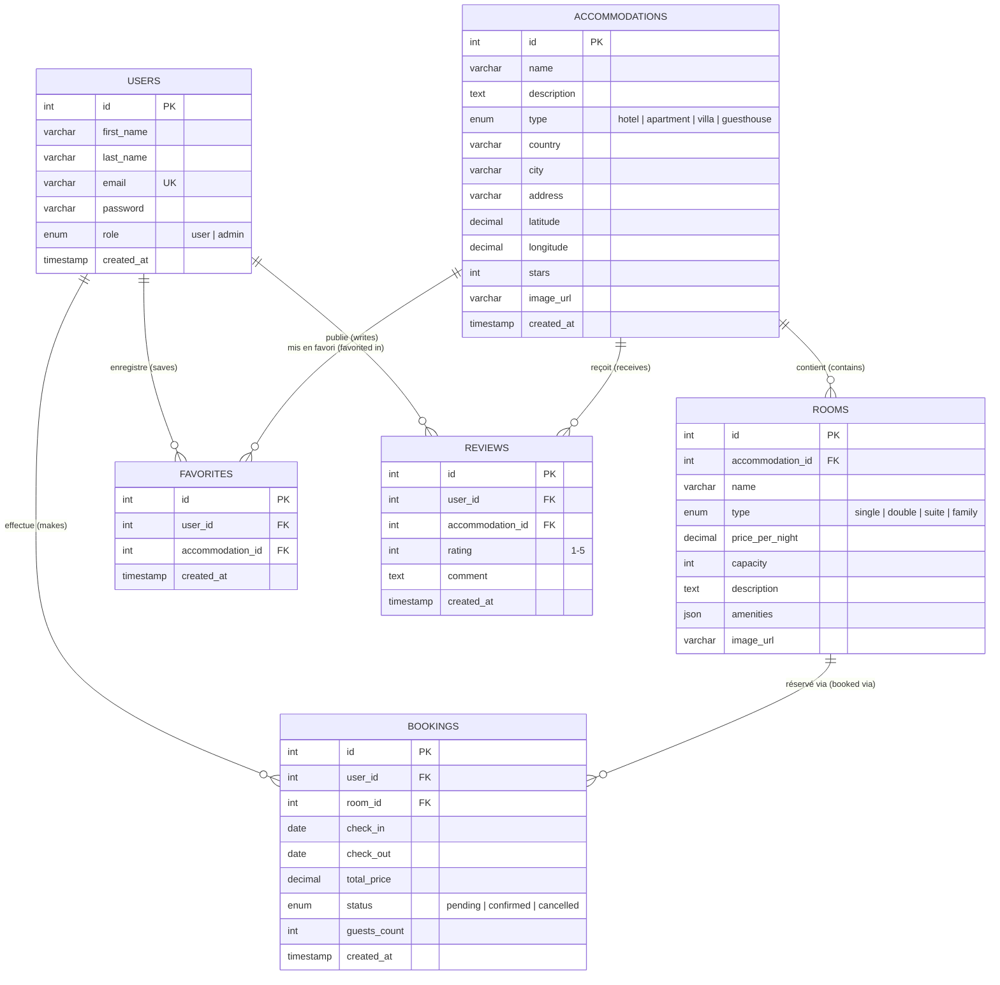

# 🏨 LUNSOLE Booking — Plateforme de Réservation Hôtelière & Sanctuaires de Luxe

> **LUNSOLE Booking** est une application web full-stack de réservation d'hébergements haut de gamme au Maroc (hôtels de luxe, riads impériaux, appartements avec vue marina et villas d'exception).

---

## 📑 Sommaire

1. [Aperçu du Projet](#-aperçu-du-projet)
2. [Stack Technologique](#-stack-technologique)
3. [Modèle Entité-Relation (Diagramme ER)](#-modèle-entité-relation-diagramme-er)
4. [Schéma & Tables de la Base de Données](#-schéma--tables-de-la-base-de-données)
5. [Architecture & Fonctionnalités](#-architecture--fonctionnalités)
6. [Installation & Démarrage](#-installation--démarrage)
7. [Comptes & Données de Test](#-comptes--données-de-test)
8. [Documentation des API](#-documentation-des-api)
9. [Documentation UML Complète](#-documentation-uml-complète)

---

## 🌟 Aperçu du Projet

LUNSOLE Booking propose une expérience de réservation fluide et intuitive :
- **Recherche multicritère :** Filtrage par ville, type d'hébergement (hôtel, riad, appartement, villa), capacité de voyageurs et gamme de prix.
- **Géolocalisation & Proximité :** Calcul de distance GPS et exploration cartographique interactive.
- **Fiche Détails Complète :** Galerie photos, suites disponibles avec calcul automatique des nuits, équipements et avis clients vérifiés.
- **Réservation Intelligente (Book Now) :** Continuité transparente de la réservation avant et après authentification (Login / Register).
- **Espace Client :** Suivi des réservations (à venir, confirmées, passées), annulation en un clic et gestion des favoris.
- **Administration Sécurisée :** Dashboard analytique, gestion du parc d'hôtels, appartements, réservations et comptes utilisateurs.

---

## 🛠️ Stack Technologique

| Couche | Technologies |
|---|---|
| **Frontend** | React 18, Vite, React Router v6, Context API, Lucide Icons, Leaflet / OpenStreetMap |
| **Backend** | Node.js, Express.js, JWT (JSON Web Tokens), bcryptjs, CORS, Dotenv |
| **Base de Données** | MySQL 8.0+ (Moteur InnoDB, relations avec clés étrangères & cascades) |
| **Architecture** | RESTful API, Middleware d'authentification & protection de rôles (User / Admin) |

---

## 📊 Modèle Entité-Relation (Diagramme ER)

Le diagramme ci-dessous illustre l'ensemble des entités de la base de données `lunsole_booking` et leurs relations de cardinalité :



---

## 🗄️ Schéma & Tables de la Base de Données

1. **`users`** : Comptes utilisateurs et administrateurs. Mots de passe hashés avec `bcrypt` (10 rounds).
2. **`accommodations`** : Établissements (hôtels, riads, appartements) avec coordonnées GPS (`latitude`, `longitude`), ville et classement par étoiles.
3. **`rooms`** : Chambres et suites associées à un hébergement avec capacité max, tarif par nuit et équipements au format JSON.
4. **`bookings`** : Réservations liant un utilisateur à une chambre, dates d'arrivée/départ (`check_in`, `check_out`), prix total et statut (`confirmed`, `cancelled`, `pending`).
5. **`favorites`** : Liste de souhaits des utilisateurs avec contrainte d'unicité `(user_id, accommodation_id)`.
6. **`reviews`** : Avis et notes de 1 à 5 étoiles laissés par les clients sur les hébergements.

---

## 🚀 Installation & Démarrage

### Prérequis
- [Node.js](https://nodejs.org/) (version 18 ou supérieure recommandée)
- [MySQL Server](https://dev.mysql.com/downloads/) (ou WampServer / XAMPP)

---

### 1. Configuration de la Base de Données

Importez le script SQL initial dans votre serveur MySQL :
```bash
mysql -u root -p < backend/database.sql
```

Ou exécutez le script automatique de configuration :
```bash
cd backend
node setup-db.js
node seed.js
node reset-users.js
```

---

### 2. Configuration du Backend

Créez ou modifiez le fichier `backend/.env` :
```env
PORT=5000
JWT_SECRET=lunsole_booking_secret_key_2026
JWT_EXPIRES_IN=7d

DB_HOST=localhost
DB_USER=root
DB_PASSWORD=
DB_NAME=lunsole_booking
```

Installez les dépendances du backend :
```bash
cd backend
npm install
```

---

### 3. Configuration du Frontend

Installez les dépendances du frontend :
```bash
cd ../frontend
npm install
```

---

### 4. Lancement Rapide (Windows)

Double-cliquez sur le fichier à la racine :
```text
start.bat
```
Ce script démarre automatiquement :
- Le serveur Backend sur `http://localhost:5000`
- Le serveur Frontend (Vite) sur `http://localhost:5173`

Ou démarrez-les manuellement dans deux terminaux :
```bash
# Terminal 1 - Backend
cd backend
node server.js

# Terminal 2 - Frontend
cd frontend
npm run dev
```

---

## 🔑 Comptes & Données de Test

| Rôle | Email | Mot de Passe | Permissions |
|---|---|---|---|
| **Administrateur** | `admin@lunsole.com` | `Admin123!` | Accès au panel `/admin`, gestion totale des hébergements, réservations et utilisateurs |
| **Client (User)** | `user@lunsole.com` | `User123!` | Recherche, réservation de suites, gestion du profil, favoris et avis |

---

## 🌐 Documentation des API

### Authentification (`/api/auth`)
- `POST /api/auth/register` : Inscription d'un nouvel utilisateur
- `POST /api/auth/login` : Connexion et délivrance du JWT
- `GET /api/auth/me` : Profil de l'utilisateur connecté *(Protégé)*

### Hébergements (`/api/accommodations`)
- `GET /api/accommodations` : Liste filtrable (`city`, `type`, `capacity`, `min_price`, `max_price`, `lat`, `lng`)
- `GET /api/accommodations/:id` : Fiche détaillée avec chambres et suites
- `POST /api/accommodations` : Ajout d'un hébergement *(Admin)*

### Réservations (`/api/bookings`)
- `POST /api/bookings` : Créer une réservation `{ roomId, checkIn, checkOut, guestsCount }` *(Protégé)*
- `GET /api/bookings/my-bookings` : Historique des réservations de l'utilisateur connecté *(Protégé)*
- `GET /api/bookings/:id` : Détails d'une réservation *(Protégé)*
- `PATCH /api/bookings/:id/cancel` : Annulation d'une réservation *(Protégé)*

### Favoris & Avis (`/api/favorites`, `/api/accommodations/:id/reviews`)
- `POST /api/favorites/:id` : Ajouter aux favoris *(Protégé)*
- `DELETE /api/favorites/:id` : Retirer des favoris *(Protégé)*
- `GET /api/favorites` : Liste des favoris de l'utilisateur *(Protégé)*
- `GET /api/accommodations/:id/reviews` : Liste des avis et note moyenne
- `POST /api/accommodations/:id/reviews` : Publier un avis *(Protégé)*

---

## 📚 Documentation UML Complète

Pour consulter l'ensemble des diagrammes d'architecture, rendez-vous dans le dossier [`docs/uml/`](./docs/uml/) :
- [01 — Diagramme Entité-Relation (ER)](./docs/uml/01_entity_relationship.md)
- [02 — Diagramme de Classes](./docs/uml/02_class_diagram.md)
- [03 — Diagramme des Cas d'Utilisation](./docs/uml/03_use_case.md)
- [04 — Diagrammes de Séquence](./docs/uml/04_sequence_diagrams.md)
- [05 — Architecture des Composants](./docs/uml/05_component_architecture.md)

---

## 👥 Auteur

Projet développé par **Fatim Zahrae Tijani** — *LUNSOLE Booking Platform*.
