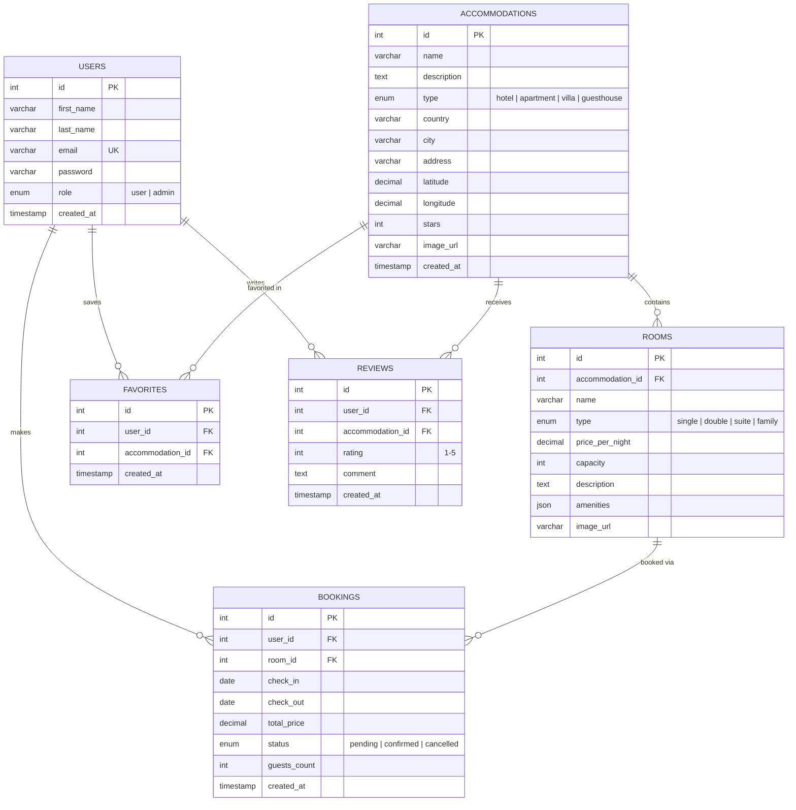

# LUNSOLE — Entity-Relationship Diagram

> Database: `lunsole_booking` (MySQL / InnoDB)

```mermaid
erDiagram
    USERS {
        int id PK
        varchar first_name
        varchar last_name
        varchar email UK
        varchar password
        enum role "user | admin"
        timestamp created_at
    }

    ACCOMMODATIONS {
        int id PK
        varchar name
        text description
        enum type "hotel | apartment | villa | guesthouse"
        varchar country
        varchar city
        varchar address
        decimal latitude
        decimal longitude
        int stars
        varchar image_url
        timestamp created_at
    }

    ROOMS {
        int id PK
        int accommodation_id FK
        varchar name
        enum type "single | double | suite | family"
        decimal price_per_night
        int capacity
        text description
        json amenities
        varchar image_url
    }

    BOOKINGS {
        int id PK
        int user_id FK
        int room_id FK
        date check_in
        date check_out
        decimal total_price
        enum status "pending | confirmed | cancelled"
        int guests_count
        timestamp created_at
    }

    FAVORITES {
        int id PK
        int user_id FK
        int accommodation_id FK
        timestamp created_at
    }

    REVIEWS {
        int id PK
        int user_id FK
        int accommodation_id FK
        int rating "1-5"
        text comment
        timestamp created_at
    }

    USERS ||--o{ BOOKINGS : "makes"
    USERS ||--o{ FAVORITES : "saves"
    USERS ||--o{ REVIEWS : "writes"
    ACCOMMODATIONS ||--o{ ROOMS : "contains"
    ACCOMMODATIONS ||--o{ FAVORITES : "favorited in"
    ACCOMMODATIONS ||--o{ REVIEWS : "receives"
    ROOMS ||--o{ BOOKINGS : "booked via"
```
