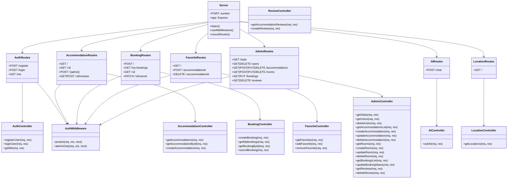

# LUNSOLE — Class Diagram (Backend Architecture)

> Node.js / Express backend — controllers, routes and middleware

```mermaid
classDiagram
    class Server {
        +PORT: number
        +app: Express
        +listen()
        +useMiddlewares()
        +mountRoutes()
    }

    class AuthMiddleware {
        +protect(req, res, next)
        +adminOnly(req, res, next)
    }

    class AuthController {
        +registerUser(req, res)
        +loginUser(req, res)
        +getMe(req, res)
    }

    class AccommodationController {
        +getAccommodations(req, res)
        +getAccommodationById(req, res)
        +createAccommodation(req, res)
    }

    class BookingController {
        +createBooking(req, res)
        +getMyBookings(req, res)
        +getBookingById(req, res)
        +cancelBooking(req, res)
    }

    class FavoriteController {
        +getFavorites(req, res)
        +addFavorite(req, res)
        +removeFavorite(req, res)
    }

    class ReviewController {
        +getAccommodationReviews(req, res)
        +createReview(req, res)
    }

    class LocationController {
        +getLocations(req, res)
    }

    class AIController {
        +askAI(req, res)
    }

    class AdminController {
        +getStats(req, res)
        +getUsers(req, res)
        +deleteUser(req, res)
        +getAccommodationsList(req, res)
        +createAccommodation(req, res)
        +updateAccommodation(req, res)
        +deleteAccommodation(req, res)
        +getRooms(req, res)
        +createRoom(req, res)
        +updateRoom(req, res)
        +deleteRoom(req, res)
        +getBookingsList(req, res)
        +updateBookingStatus(req, res)
        +getReviews(req, res)
        +deleteReview(req, res)
    }

    class AuthRoutes {
        +POST /register
        +POST /login
        +GET /me
    }

    class AccommodationRoutes {
        +GET /
        +GET /:id
        +POST / [admin]
        +GET|POST /:id/reviews
    }

    class BookingRoutes {
        +POST /
        +GET /my-bookings
        +GET /:id
        +PATCH /:id/cancel
    }

    class FavoriteRoutes {
        +GET /
        +POST /:accommodationId
        +DELETE /:accommodationId
    }

    class AdminRoutes {
        +GET /stats
        +GET|DELETE /users
        +GET|POST|PUT|DELETE /accommodations
        +GET|POST|PUT|DELETE /rooms
        +GET|PUT /bookings
        +GET|DELETE /reviews
    }

    class AIRoutes {
        +POST /chat
    }

    class LocationRoutes {
        +GET /
    }

    Server --> AuthRoutes
    Server --> AccommodationRoutes
    Server --> BookingRoutes
    Server --> FavoriteRoutes
    Server --> AdminRoutes
    Server --> AIRoutes
    Server --> LocationRoutes

    AuthRoutes --> AuthController
    AuthRoutes --> AuthMiddleware

    AccommodationRoutes --> AccommodationController
    AccommodationRoutes --> AuthMiddleware

    BookingRoutes --> BookingController
    BookingRoutes --> AuthMiddleware

    FavoriteRoutes --> FavoriteController
    FavoriteRoutes --> AuthMiddleware

    AdminRoutes --> AdminController
    AdminRoutes --> AuthMiddleware

    AIRoutes --> AIController
    LocationRoutes --> LocationController
```
