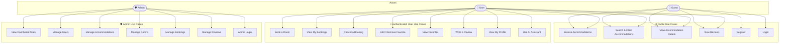

# LUNSOLE — Use Case Diagram

> Actors: **Guest** (unauthenticated), **User** (authenticated), **Admin**

```mermaid
flowchart TD
    subgraph Actors
        Guest(["👤 Guest"])
        User(["🔐 User"])
        Admin(["🛡️ Admin"])
    end

    subgraph Public ["🌐 Public Use Cases"]
        UC1["Browse Accommodations"]
        UC2["Search & Filter Accommodations"]
        UC3["View Accommodation Details"]
        UC4["View Reviews"]
        UC5["Register"]
        UC6["Login"]
    end

    subgraph Authenticated ["🔑 Authenticated User Use Cases"]
        UC7["Book a Room"]
        UC8["View My Bookings"]
        UC9["Cancel a Booking"]
        UC10["Add / Remove Favorite"]
        UC11["View Favorites"]
        UC12["Write a Review"]
        UC13["View My Profile"]
        UC14["Use AI Assistant"]
    end

    subgraph AdminPanel ["🛡️ Admin Use Cases"]
        UC15["View Dashboard Stats"]
        UC16["Manage Users"]
        UC17["Manage Accommodations"]
        UC18["Manage Rooms"]
        UC19["Manage Bookings"]
        UC20["Manage Reviews"]
        UC21["Admin Login"]
    end

    Guest --> UC1
    Guest --> UC2
    Guest --> UC3
    Guest --> UC4
    Guest --> UC5
    Guest --> UC6

    User --> UC1
    User --> UC2
    User --> UC3
    User --> UC4
    User --> UC7
    User --> UC8
    User --> UC9
    User --> UC10
    User --> UC11
    User --> UC12
    User --> UC13
    User --> UC14

    Admin --> UC21
    Admin --> UC15
    Admin --> UC16
    Admin --> UC17
    Admin --> UC18
    Admin --> UC19
    Admin --> UC20
```
