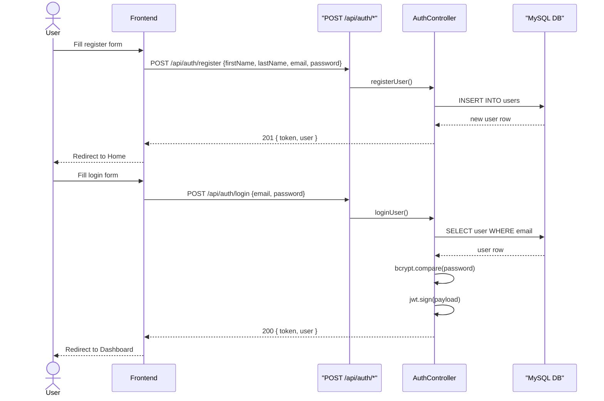
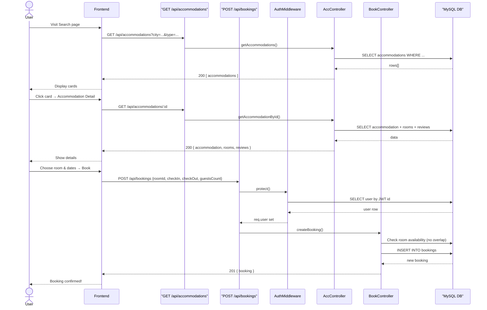
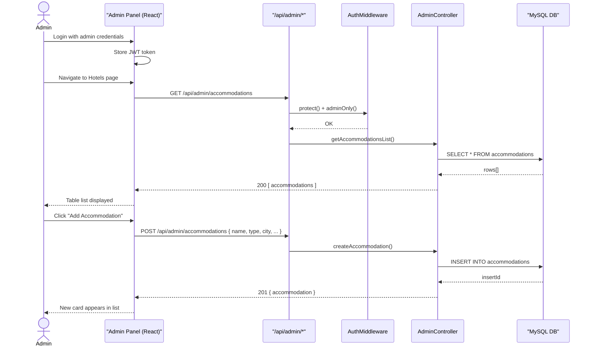
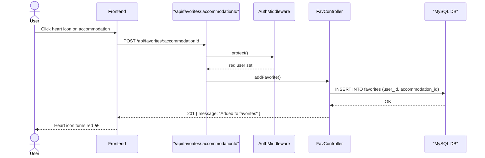

# LUNSOLE — Sequence Diagrams

## 1. User Registration & Login

```mermaid
sequenceDiagram
    actor User
    participant Frontend
    participant AuthRoutes as "POST /api/auth/*"
    participant AuthController
    participant DB as "MySQL DB"

    User->>Frontend: Fill register form
    Frontend->>AuthRoutes: POST /api/auth/register {firstName, lastName, email, password}
    AuthRoutes->>AuthController: registerUser()
    AuthController->>DB: INSERT INTO users
    DB-->>AuthController: new user row
    AuthController-->>Frontend: 201 { token, user }
    Frontend-->>User: Redirect to Home

    User->>Frontend: Fill login form
    Frontend->>AuthRoutes: POST /api/auth/login {email, password}
    AuthRoutes->>AuthController: loginUser()
    AuthController->>DB: SELECT user WHERE email
    DB-->>AuthController: user row
    AuthController->>AuthController: bcrypt.compare(password)
    AuthController->>AuthController: jwt.sign(payload)
    AuthController-->>Frontend: 200 { token, user }
    Frontend-->>User: Redirect to Dashboard
```

---

## 2. Browse & Book an Accommodation

```mermaid
sequenceDiagram
    actor User
    participant Frontend
    participant AccRoutes as "GET /api/accommodations"
    participant BookRoutes as "POST /api/bookings"
    participant AuthMiddleware
    participant AccController
    participant BookController
    participant DB as "MySQL DB"

    User->>Frontend: Visit Search page
    Frontend->>AccRoutes: GET /api/accommodations?city=...&type=...
    AccRoutes->>AccController: getAccommodations()
    AccController->>DB: SELECT accommodations WHERE ...
    DB-->>AccController: rows[]
    AccController-->>Frontend: 200 [ accommodations ]
    Frontend-->>User: Display cards

    User->>Frontend: Click card → Accommodation Detail
    Frontend->>AccRoutes: GET /api/accommodations/:id
    AccRoutes->>AccController: getAccommodationById()
    AccController->>DB: SELECT accommodation + rooms + reviews
    DB-->>AccController: data
    AccController-->>Frontend: 200 { accommodation, rooms, reviews }
    Frontend-->>User: Show details

    User->>Frontend: Choose room & dates → Book
    Frontend->>BookRoutes: POST /api/bookings {roomId, checkIn, checkOut, guestsCount}
    BookRoutes->>AuthMiddleware: protect()
    AuthMiddleware->>DB: SELECT user by JWT id
    DB-->>AuthMiddleware: user row
    AuthMiddleware-->>BookRoutes: req.user set
    BookRoutes->>BookController: createBooking()
    BookController->>DB: Check room availability (no overlap)
    BookController->>DB: INSERT INTO bookings
    DB-->>BookController: new booking
    BookController-->>Frontend: 201 { booking }
    Frontend-->>User: Booking confirmed!
```

---

## 3. Admin — Manage Accommodations

```mermaid
sequenceDiagram
    actor Admin
    participant AdminPanel as "Admin Panel (React)"
    participant AdminRoutes as "/api/admin/*"
    participant AuthMiddleware
    participant AdminController
    participant DB as "MySQL DB"

    Admin->>AdminPanel: Login with admin credentials
    AdminPanel->>AdminPanel: Store JWT token

    Admin->>AdminPanel: Navigate to Hotels page
    AdminPanel->>AdminRoutes: GET /api/admin/accommodations
    AdminRoutes->>AuthMiddleware: protect() + adminOnly()
    AuthMiddleware-->>AdminRoutes: OK
    AdminRoutes->>AdminController: getAccommodationsList()
    AdminController->>DB: SELECT * FROM accommodations
    DB-->>AdminController: rows[]
    AdminController-->>AdminPanel: 200 [ accommodations ]
    AdminPanel-->>Admin: Table list displayed

    Admin->>AdminPanel: Click "Add Accommodation"
    AdminPanel->>AdminRoutes: POST /api/admin/accommodations { name, type, city, ... }
    AdminRoutes->>AdminController: createAccommodation()
    AdminController->>DB: INSERT INTO accommodations
    DB-->>AdminController: insertId
    AdminController-->>AdminPanel: 201 { accommodation }
    AdminPanel-->>Admin: New card appears in list
```

---

## 4. Add to Favorites

```mermaid
sequenceDiagram
    actor User
    participant Frontend
    participant FavRoutes as "/api/favorites/:accommodationId"
    participant AuthMiddleware
    participant FavController
    participant DB as "MySQL DB"

    User->>Frontend: Click heart icon on accommodation
    Frontend->>FavRoutes: POST /api/favorites/:accommodationId
    FavRoutes->>AuthMiddleware: protect()
    AuthMiddleware-->>FavRoutes: req.user set
    FavRoutes->>FavController: addFavorite()
    FavController->>DB: INSERT INTO favorites (user_id, accommodation_id)
    DB-->>FavController: OK
    FavController-->>Frontend: 201 { message: "Added to favorites" }
    Frontend-->>User: Heart icon turns red ❤️
```
