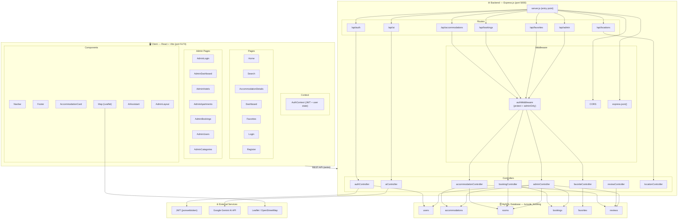

# LUNSOLE — Component & Architecture Diagram

> Full-stack overview: React (Vite) frontend + Express.js backend + MySQL database

```mermaid
graph TB
    subgraph Client["🖥️ Client — React + Vite (port 5173)"]
        subgraph Pages
            PH["Home"]
            PS["Search"]
            PAD["AccommodationDetails"]
            PD["Dashboard"]
            PF["Favorites"]
            PL["Login"]
            PR["Register"]
        end
        subgraph AdminPages["Admin Pages"]
            PAL["AdminLogin"]
            PADA["AdminDashboard"]
            PAH["AdminHotels"]
            PAA["AdminApartments"]
            PAB["AdminBookings"]
            PAU["AdminUsers"]
            PAC["AdminCategories"]
        end
        subgraph Components
            Navbar["Navbar"]
            Footer["Footer"]
            AccCard["AccommodationCard"]
            MapComp["Map (Leaflet)"]
            AIChat["AIAssistant"]
            AdminLayout["AdminLayout"]
        end
        subgraph Context
            AuthCtx["AuthContext (JWT + user state)"]
        end
    end

    subgraph Backend["⚙️ Backend — Express.js (port 5000)"]
        direction TB
        Server["server.js (entry point)"]

        subgraph Middleware["Middleware"]
            MW_Auth["authMiddleware\n(protect + adminOnly)"]
            MW_CORS["CORS"]
            MW_JSON["express.json()"]
        end

        subgraph Routes["Routes"]
            R_Auth["/api/auth"]
            R_Acc["/api/accommodations"]
            R_Book["/api/bookings"]
            R_Fav["/api/favorites"]
            R_Admin["/api/admin"]
            R_AI["/api/ai"]
            R_Loc["/api/locations"]
        end

        subgraph Controllers["Controllers"]
            C_Auth["authController"]
            C_Acc["accommodationController"]
            C_Book["bookingController"]
            C_Fav["favoriteController"]
            C_Rev["reviewController"]
            C_Admin["adminController"]
            C_AI["aiController"]
            C_Loc["locationController"]
        end
    end

    subgraph DB["🗄️ MySQL Database — lunsole_booking"]
        T_Users["users"]
        T_Acc["accommodations"]
        T_Rooms["rooms"]
        T_Book["bookings"]
        T_Fav["favorites"]
        T_Rev["reviews"]
    end

    subgraph External["🌐 External Services"]
        JWT["JWT (jsonwebtoken)"]
        GeminiAI["Google Gemini AI API"]
        Leaflet["Leaflet / OpenStreetMap"]
    end

    %% Client ↔ Backend
    Client -- "REST API (axios)" --> Backend

    %% Server wiring
    Server --> MW_CORS
    Server --> MW_JSON
    Server --> R_Auth
    Server --> R_Acc
    Server --> R_Book
    Server --> R_Fav
    Server --> R_Admin
    Server --> R_AI
    Server --> R_Loc

    %% Routes → Middleware → Controllers
    R_Auth --> C_Auth
    R_Acc --> MW_Auth
    MW_Auth --> C_Acc
    R_Book --> MW_Auth
    MW_Auth --> C_Book
    R_Fav --> MW_Auth
    MW_Auth --> C_Fav
    R_Admin --> MW_Auth
    MW_Auth --> C_Admin
    R_AI --> C_AI
    R_Loc --> C_Loc

    %% Controllers → DB
    C_Auth --> T_Users
    C_Acc --> T_Acc
    C_Acc --> T_Rooms
    C_Acc --> T_Rev
    C_Book --> T_Book
    C_Book --> T_Rooms
    C_Fav --> T_Fav
    C_Rev --> T_Rev
    C_Admin --> T_Users
    C_Admin --> T_Acc
    C_Admin --> T_Rooms
    C_Admin --> T_Book
    C_Admin --> T_Rev

    %% External
    C_Auth --> JWT
    C_AI --> GeminiAI
    MapComp --> Leaflet
```
